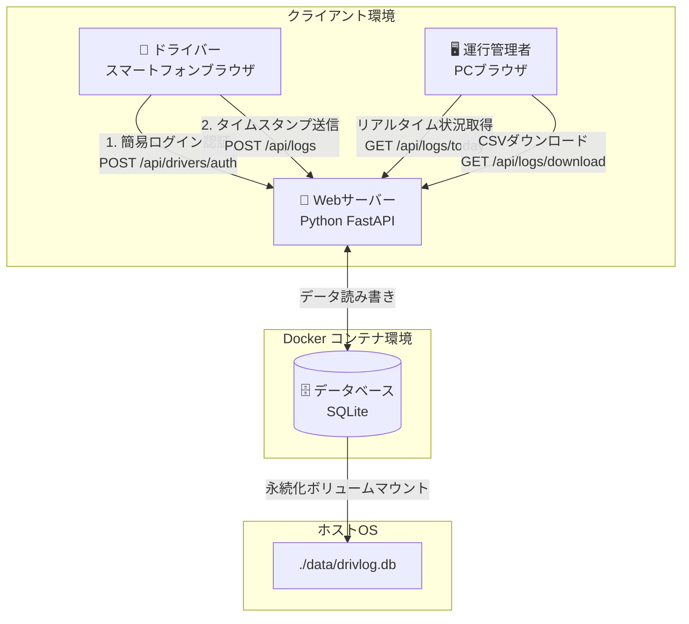

# クラウドプラットフォーム実習Ⅱ レポート草案集

本ドキュメントは、「クラウドプラットフォーム実習Ⅱ」の各レポート（レポート1〜5、および最終レポート）を効率的かつ高い評価で進めるための具体的な草案をまとめたものです。
「教育機関および中小企業のDX推進とセキュリティ」を一貫した共通テーマに据え、実習で扱う「Keycloak」「Docker」「Dify / LLM（Gemma 4 等）」の技術スタックを統合した一貫性のある構成にしています。

---

## 📂 目次
1. [レポート1：従来型 vs クラウドネイティブ型プライベートクラウド](#レポート1従来型-vs-クラウドネイティブ型プライベートクラウド)
2. [レポート2：教育機関におけるセキュリティ対策（Keycloak）](#レポート2教育機関におけるセキュリティ対策keycloak)
3. [レポート3：分野別アプリ作成（Difyを用いた内規・マニュアルFAQボット）](#レポート3分野別アプリ作成difyを用いた内規マニュアルfaqボット)
4. [レポート4：不安を解消するクラウド啓蒙マンガ](#レポート4不安を解消するクラウド啓蒙マンガ)
5. [レポート5：オリジナルソリューションの要件定義書](#レポート5オリジナルソリューションの要件定義書)
6. [最終レポート：ソリューション実装・ビジネスモデル・デモ動画](#最終レポートソリューション実装ビジネスモデルデモ動画)

---

## レポート1：従来型 vs クラウドネイティブ型プライベートクラウド

### 1. 概要と主張
* **主張**：これからプライベートクラウドに取り組む場合、**「Kubernetesおよびコンテナ中心のクラウドネイティブ型プライベートクラウド」**に注力すべきである。
* **理由**：開発速度の向上（俊敏性）、リソース利用効率の最大化、将来的なハイブリッド/マルチクラウド移行への親和性が極めて高いため。

### 2. 本文構成案

#### ① 特徴
* **従来型（VM中心）**：ハイパーバイザー（VMware ESXi, Proxmox VE等）を用いて物理ハードウェア上に仮想マシン（Guest OSを含む）を構築。OS層が重複するため起動が遅くリソース消費が多い。
* **クラウドネイティブ型（コンテナ中心）**：ホストOSのカーネルを共有し、プロセスレベルで隔離されたコンテナを動作させる。Kubernetes等のオーケストレーターで自律的なスケーリングや自己修復を行う。

#### ② 事例
* **従来型**：地方自治体の情報システム共通基盤（セキュリティ要件が厳しく、レガシーOSの維持が必要なシステム群の移行先）。
* **クラウドネイティブ型**：『Roblox』のインフラ基盤（Nomadを使用したコンテナ運用）、メルカリやNetflixなどの大規模マイクロサービス群。

#### ③ 技術的なメリット
* **従来型**：OSレベルでの堅牢なセキュリティ分離。既存 of オンプレミスサーバーのイメージをほぼそのままP2V（Physical to Virtual）で移行可能。
* **クラウドネイティブ型**：起動が高速（数秒）。リソース消費が極めて小さく、高密度にアプリケーションを配置可能。宣言的定義（YAML）によるInfrastructure as Code (IaC) の実現。

#### ④ 技術的なデメリット
* **従来型**：リソースのオーバーヘッドが大きい。スケールアウトやプロビジョニングに時間がかかる（数分〜数十分）。
* **クラウドネイティブ型**：カーネルを共有するため、脆弱性による影響範囲が広い。Kubernetes等の学習・運用コストが非常に高い。ステートフル（データベースなど）なデータの維持・永続化の設計が複雑。

#### ⑤ 自分の考える注力すべき理由
* デジタルトランスフォーメーション（DX）において「リリースの俊敏性」が最優先される現代、コンテナ技術は必須である。
* また、将来的にオンプレミスからパブリッククラウド（AWS/Azure/GCP）へシームレスに移行・連携（ハイブリッド）させるためにも、Kubernetesベースの技術スタックに初期から投資しておく方が長期的投資対効果（ROI）が高い。

### 3. エビデンス（スクショ）の準備
* ローカル環境で Docker / Docker Compose もしくは Microk8s を動かし、後述のチャットボット（Dify等）のコンテナが起動している状態をターミナルで確認するコマンド（`docker ps`）のスクリーンショット。
* ブラウザ上でWebUIが表示されている画面のスクリーンショット。

---

## レポート2：教育機関におけるセキュリティ対策（Keycloak）

### 1. 概要設定
* **選択する立場**：**教職員側**の立場。
* **理由**：教職員は成績データ、個人情報、研究費に関わる財務データなど「漏洩した際の影響が甚大な情報」を扱うため、厳格なセキュリティ対策（多要素認証や強固なパスワードポリシー）の導入意義を最も強く主張できる。

### 2. スライド構成案（発表時間：2〜3分）

* **スライド1：表紙**
  * タイトル：「教育機関における職員アカウントのセキュリティ強化 〜Keycloakによる多要素認証(MFA)とID統合管理〜」
  * 発表者名
* **スライド2：現状と課題**
  * 教育機関では多くのWebサービス（教務システム、LMS、メール、ファイル共有など）が乱立。
  * 職員が同一の脆弱なパスワードを使い回す傾向があり、フィッシング詐欺やパスワードリスト型攻撃による「アカウント乗っ取り」の危険性が常にある。
* **スライド3：提案内容（Keycloakの活用）**
  * **シングルサインオン（SSO）の一元化**：ID/PWの入力機会を減らし、認証履歴を集中監視。
  * **多要素認証（MFA/ワンタイムパスワード）の義務化**：スマートフォンアプリ（Google Authenticator等）を利用したOTPの入力。
  * **パスワードポリシーの厳格化**：英数記号混在、最低12文字以上、定期的なパスワード再利用禁止。
* **スライド4：他大学での導入事例**
  * 〇〇大学などの全学アカウントMFA義務化事例を引用。
* **スライド5：導入検証（Keycloakによる動作確認）**
  * 実際に構築した認証画面、OTP登録（QRコード表示）画面、認証成功のログ画面を貼付。
* **スライド6：まとめ**
  * 認証の強化は利便性を損なう懸念があるが、SSOによるログイン手間の削減とMFAの義務化を組み合わせることで、セキュリティと使いやすさを両立させる。

### 3. 動作確認エビデンス（実習手順）
1. Docker 等で Keycloak を起動。
2. 職員用レルム（例：`staff-realm`）を作成。
3. `Authentication` 設定で `Browser` フローの `OTP` を `Required` に変更。
4. `Password Policy` で文字数や複雑性を設定。
5. テストユーザーを作成し、初回ログイン時にパスワード変更およびOTP登録を求める挙動を確認し、そのステップごとの画面キャプチャを撮影する。

---

## レポート3：分野別アプリ作成（Difyを用いた内規・マニュアルFAQボット）

### 1. 概要と選択分野
* **選択分野**：**業務アプリケーション**
* **作成するものの名称**：**「EduFAQ Chatbot (学則・内規FAQチャットシステム)」**
* **概要**：大学の履修要覧や学則、教職員用の操作マニュアル等のPDFデータをナレッジ（知識ベース）として学習させたRAG（検索拡張生成）チャットボット。DifyのGUIを用いてノーコードで構築し、APIで公開。
* **どのような課題を解決できるのか**：
  * 学生や新任教職員が「履修登録の方法」「学則の解釈」「証明書の発行手続き」などを問い合わせる際、分厚いマニュアルを読み解く手間を省き、24時間即座に正確な回答（該当ページの参照ソース付き）を返せる。
  * 事務窓口の電話対応やメール対応の件数を削減し、業務効率化を実現。
* **作成したアプリの特徴・工夫点**：
  * **RAG（Vector DB）の精度向上**：PDFをただ流し込むのではなく、Q&A形式に分割してインデックス化し、回答のブレを抑えた。
  * **ソース開示**：AIが回答する際、「〇〇学則 第3条」といったソースとなった箇所を必ず明示し、ユーザーが原文を確認しやすい設計にした。
* **ライセンス**：
  * Dify (Apache 2.0 License)
  * バックエンドLLM（Gemma 4: オープンライセンス）
* **システム構成図・使用ソフトウェア一覧**：
  | コンポーネント | 技術・サービス名 | 役割・ライセンス |
  | --- | --- | --- |
  | プラットフォーム | Dify (オープンソース版) | チャットフロー構築、RAG（知識ベース）管理、UI提供 |
  | データベース | PostgreSQL, Vector DB | ユーザーデータ、文書ベクトルデータの永続化 |
  | AI (LLM) | Gemma 4 または Granite 4 | ユーザーの質問に対する回答テキスト生成 |
  | インフラ | Docker / Docker Compose | Difyおよび周辺ミドルウェアの一括コンテナ起動 |
  | バージョン管理 | GitHub | マニフェストや設定ファイルのバージョン管理 |

#### ④ ソースコードの確認先URL
* 自身のGitHubリポジトリ（例：`https://github.com/ユーザー名/edufaq-dify`）
* ディレクトリ内に `docker-compose.yml` および初期設定用の構成ファイルを配置。

#### ⑤ 実際に動いていることがわかる画面ショット
* DockerでDifyコンテナ群を起動し、ブラウザでDify of チャット画面にアクセス。実際に大学の内規マニュアルに基づいた質問をし、ボットが正しいソース（PDF）を提示しながら回答している画面のスクショ。

---

## レポート4：不安を解消するクラウド啓盟マンガ

### 1. 概要設定
* **前提**：A社の経営陣（特に「クラウドはデータ漏洩や消失が不安だ」と主張する古参役員）に向けて、わずか60秒（エレベーターに乗っている時間）でクラウドの安全性とメリットを理解させ、「自社でもクラウド（CRM・社内Wiki・チャット等）を活用しよう！」と思わせるためのA3両面（折りたたんでA4）のマンガ小冊子。

### 2. マンガのコマ割り・プロット案（A3見開き構成）

#### 📖 表面（折りたたみ時の表紙と裏表紙）
* **【表紙（A4縦・右半分）】**
  * **タイトル**：「どうしてクラウドは怖いの？ 〜A社が踏み出す、安全で便利なDXへの第一歩〜」
  * **ビジュアル**：険しい表情で「うちの大事な顧客データが心配だ！」と言う役員と、にこやかに「大丈夫です！」と答える新入社員。
* **【裏表紙（A4縦・左半分）】**
  * **内容**：クラウド導入で得られるメリットのロードマップ（Wiki、チャット、AI、RPAの段階的導入）。「A社の次の成長へ、まずはクラウドから！ お問い合わせ：新入社員〇〇」

#### 📖 内面（A3見開き・メインコンテンツ）
* **【第1章：セキュリティの真真（見開き左側）】**
  * **コマ1**：役員が「クラウドはデータを他人に預けるから危ないんじゃないか？」と疑問を呈す。
  * **コマ2**：新人が「実は逆です！ 自社の鍵付きサーバー室と、世界最強クラスのセキュリティのプロが24時間監視するデータセンター、どちらが侵入されやすいでしょうか？」と図解。
  * **コマ3**：不正アクセス対策、データ暗号化、定期アップデートが自動で行われるクラウドの仕組みを説明。役員が「なるほど、自社でやるより安全なのか…」と納得し始める。
* **【第2章：もしもの災害・障害対策（見開き右側）】**
  * **コマ1**：役員が「検察障害や震災が来たら、業務が止まってデータも消えるのでは？」と不安をこぼす。
  * **コマ2**：新人が「クラウドは世界中にデータが三重に自動コピーされています。万が一オフィスが被災してもデータは無傷で、自宅からでもすぐに仕事が再開できます！（BCP対策）」とアピール。
  * **コマ3**：役員が笑顔になり「それなら安心だな！ CRM以外にも、社内Wikiやチャット、AI活用も進めていこう！」と宣言。
  * **コマ4**：新人と役員がガッツポーズ。「安全なクラウドで、A社のDXを加速させましょう！」

---

## レポート5：オリジナルソリューションの要件定義書

### 1. 科目・チーム情報（Wordテンプレート入力用）
* **科目名**：クラウドプラットフォーム実習Ⅱ
* **年度**：2026年度
* **レポート番号**：レポート5 (オリジナルソリューションの要件定義)
* **チーム名**：自主開発チーム (個人開発)
* **メンバー**：代表者：[ご自身の名前] / 学籍番号：[ご自身の学籍番号]

---

### 2. ソリューション要件

#### ① 概要
運送業の「物流2024年問題」に対応するため、各ドライバーがスマートフォンのブラウザから「運行開始」「待機開始」「荷役開始」「業務終了」などのアクションボタンを押すだけで、正確な時刻（タイムスタンプ）が自動で記録・計算されるWebアプリケーション「DrivLog」を開発します。また、運送途中の公道や倉庫といった屋外からアクセスされる性質に配慮し、不特定多数の第三者が誤操作・不正アクセスできないよう、ドライバーごとに4桁の暗証番号（PIN）を要求する簡易ログイン認証機能を実装します。

#### ② 背景
2024年4月からトラックドライバーの時間外労働に年960時間の上限規制が適用され、運送業界では運行時間の効率化が急務となっています。特に荷主勧告制度や法改正において「荷待ち・荷役時間を原則2時間以内（努力目標1時間以内）」とする**「荷待ち2時間ルール」**への対応が強く求められており、運行実績の厳格な把握と記録が義務化されました。しかし、多くの小規模運送会社では高額なシステムを導入できず、紙の日報に手書きで記録しているため、交渉や行政監査に対応できるデータが決定的に不足しています。

#### ③ どんな課題を解決できるのか
* **「荷待ち2時間ルール」への低コスト対応**：高額な車載器やGPS端末を導入せずとも、各ドライバーのスマートフォンからボタンをタップするだけで、法律で求められる正確な荷待ち時間の計測・記録を業界最安クラスの低コスト（初期10万円、月額1万円）で即座に開始できます。
* **事務コストの削減**：ドライバーの手書きメモや、管理者のExcel転記・計算の手間（引き算のミス等）をゼロにします。
* **荷主交渉および行政監査向けエビデンス確保**：記録された正確な待機時間をCSV形式で出力し、荷主に対して「荷待ち削減に向けた改善交渉」を行うための客観的データや、行政監査時の運行管理記録として活用できます。
* **セキュリティ・誤送信の防止**：各ドライバーに専用の暗証番号を割り当てることで、なりすましによる誤入力を防止しつつ、手袋を着用した状態のスマホ操作でも使いやすい簡便な操作性を維持します。

#### ④ ソリューションの導入により、将来、会社がどのように成長するのか
* **労働環境改善によるドライバー離職防止**：正確な労務管理により過重労働を防止し、健全な労働環境を提供することで、ドライバー不足を解消します。
* **収益性の向上**：客観的な待機時間データを基に荷主と交渉し、荷待ち時間が削減されることでトラックの回転率が向上。同じ人員・車両数のまま稼働率を最大15%〜20%引き上げ、売上を向上させることができます。

#### ⑤ 想定利用対象者
* トラックを5〜30台程度保有する、高額な運行管理システムを導入できない小規模・中堅運送会社の「運行管理者」および「トラックドライバー」。

---

### 3. 機能要件

#### ① System Architecture (システム構成図)
Docker Composeを用いてパッケージ化されたWebアプリケーションサーバー（FastAPI）と、データの永続化を行う軽量データベース（SQLite）のシングルコンテナ構造で構築します。



#### ② 独自開発部分以外の使用ソフトウェア一覧
| ソフトウェア名 | バージョン | ライセンス | 用途 |
| --- | --- | --- | --- |
| Python | 3.11 | PSF License | アプリケーション実行言語 |
| FastAPI | 0.100+ | MIT License | バックエンドREST APIサーバー |
| Uvicorn | 0.22+ | BSD License | ASGIアプリケーションサーバー |
| SQLite | 3 | Public Domain | 軽量リレーショナルデータベース |
| Docker / Docker Compose | Latest | Apache 2.0 | コンテナ化・一括実行プラットフォーム |

#### ③ 独自開発部分以外の使用外部サービス一覧
* なし (完全なローカル/プライベート環境で動作するため、外部APIやクラウド有料サービスへの依存がなく、セキュリティ的にも極めて安全です)

#### ④ 想定画面
* **SCR-01 ドライバー運行記録画面 (スマホ特化)**：ドライバーが自分の名前を選択し、4桁の暗証番号でログインを行った後に、大きな4つのボタンでステータスを送信する画面。
* **SCR-02 運行管理者ダッシュボード (PC向け)**：本日の全員のステータスと累積待機時間を一覧表示し、CSVでダウンロードする画面。新規ドライバーの登録や、暗証番号の設定も行えます。

#### ⑤ 画面一覧
| 画面ID | 画面名 | 対象ユーザー | 主要機能 |
| --- | --- | --- | --- |
| SCR-01 | ドライバー運行記録画面 | ドライバー | ドライバー選択、暗証番号(PIN)による簡易ログイン認証、車両番号表示、運行ステータス（運行・待機・荷役・終了）のワンタップ記録、任意メモ送信、当日の送信履歴表示 |
| SCR-02 | 運行管理者ダッシュボード | 運行管理者 | 全ドライバーの現在状況・本日の累積待機時間のリアルタイム監視、CSVデータ一括ダウンロード、新規ドライバー登録(暗証番号設定含む)、動作デモ用リセット機能 |

#### ⑥ データ定義（データベース）
* **テーブル一覧**
  | テーブル名 | 物理名 | 役割 |
  | --- | --- | --- |
  | ドライバーマスタ | `drivers` | 運行システムを利用するドライバーと車両、および暗証番号の紐付け情報を管理 |
  | タイムスタンプログ | `logs` | ドライバーがボタンを押した際のイベント種別と記録時刻を保持 |

* **カラム定義**
  * `drivers` (ドライバーマスタ)
    | カラム名 | 物理名 | 型 | 制約 | 説明 |
    | --- | --- | --- | --- | --- |
    | ID | `id` | INTEGER | PRIMARY KEY (Auto Inc) | ドライバーの一意なID |
    | 氏名 | `name` | TEXT | NOT NULL, UNIQUE | ドライバーの氏名 |
    | 車両番号 | `vehicle_number` | TEXT | NOT NULL | 担当車両のナンバープレート情報 |
    | 暗証番号 | `pin` | TEXT | NOT NULL (Default '1234') | ログイン認証用4桁PINコード |

  * `logs` (タイムスタンプログ)
    | カラム名 | 物理名 | 型 | 制約 | 説明 |
    | --- | --- | --- | --- | --- |
    | ID | `id` | INTEGER | PRIMARY KEY (Auto Inc) | ログレコードの一意なID |
    | ドライバーID | `driver_id` | INTEGER | FOREIGN KEY | `drivers.id` への参照 |
    | 運行ステータス | `status` | TEXT | NOT NULL | 'DRIVING', 'WAITING', 'WORKING', 'OFFLINE' |
    | 記録時刻 | `timestamp` | TEXT | NOT NULL | ISO8601形式の日本時間 (Asia/Tokyo) |
    | メモ | `note` | TEXT | NULL | 渋滞や荷主都合などの特記事項 |

---

### 4. 非機能要件

#### ① 拡張性
* 将来的にGPS位置情報取得APIと連携し、待機開始ボタンを押した場所が「指定された倉庫の半径100m以内であるか」を自動判定し、虚偽報告を防止する機能を拡張可能。
* データベース接続に SQLAlchemy などの ORM を用いているため、将来的な大規模化（数千台の運行管理）の際には SQLite から PostgreSQL や AWS RDS などのマネージドデータベースへソースコードの改修を最小限に抑えて移行可能。

#### ② 稼働環境
* **システム側 (サーバー環境)**
  * Docker / Docker Compose が動作可能なマシン（Linux、macOS、Windows Server、またはオンプレミスの Raspberry Pi 等）
  - CPU: 1 Core 以上、メモリ: 512MB 以上、空きストレージ: 10GB 以上
* **利用者側 (クライアント・ブラウザ環境)**
  * ドライバー側：Safari (iOS 15以上) / Google Chrome (Android OS 9以上) のスマートフォンブラウザ
  * 管理者側：Google Chrome / Microsoft Edge / Safari などの最新のモダンPCブラウザ

#### ③ 保守内容
* **定期バックアップ**：データベースファイル（`/data/drivlog.db`）を、毎日深夜に指定された外部バックアップストレージ（NASやクラウドストレージ）へ自動複製するバッチスクリプトを提供。
* **バグサポート・マイナーアップデート**：初回導入から1年間、動作不具合に対する無償リモート保守。ブラウザの仕様変更に伴うレイアウト崩れ等の改修サポート。

#### ④ 導入費
* **初期導入費用：100,000円（一時払い・税別）**
  * 構成内訳：
    1. サーバーマシンへの Docker Compose 環境の導入および設定。
    2. 初期マスタデータ（所有車両、所属ドライバー情報、暗証番号）のデータベース登録。
    3. 管理者・ドライバー向け簡易操作トレーニングおよび操作マニュアル（PDF）の提供。

#### ⑤ 利用料
* **月額利用料 (保守・サポート契約)：10,000円 / 月（税別）**
  * 構成内訳：
    1. サーバーの稼働監視およびデータバックアップ監視。
    2. トラブル発生時のリモート接続による原因究明・復旧サポート。
    3. 法改正に伴う出力CSVフォーマットの調整など、軽微なアップデート対応。

---

## 最終レポート：ソリューション実装・ビジネスモデル・デモ動画

### 1. 提案するクラウドサービスの名称
**「DrivLog (ドライブログ)」**

### 2. ビジネスモデルと費用対効果 (ROI)
* **初期費用**：100,000円
* **月額費用**：10,000円 (年間120,000円)
* **主な強み**:
  * **「荷待ち2時間ルール」への最安対応**: 大手メーカーのデジタコ（デジタルタコグラフ）や運行管理パッケージ（初期数十万〜数百万円、月額数千円/台）に比べ、ドライバーのスマートフォンブラウザを利用するWeb型のため、車両台数に関わらず「初期10万、月額1万」という圧倒的な低価格で導入可能です。
* **費用対効果の試算**：
  * **現状のコスト**：毎日20台のトラックが運行。各ドライバーが紙の日報を書き、事務員が月間「20時間」かけて日報の回収、待機時間の計算、エクセルへの転記を行っている。（事務員の人件費1,500円/時で換算すると、**月間30,000円**のコスト）。
  * **導入後のコスト**：月額利用料 **10,000円** のみ。事務員の作業時間は月間1時間に推移され、**28,500円/月**のコスト削減を達成。
  * **投資回収期間**：初期費用100,000円は、導入後わずか4ヶ月で回収完了（初年度から約12万円の純利益効果）。さらに、「荷待ち2時間ルール」に基づく超過待機料の請求や改善交渉の成立により、投資は即座に回収されます。

### 3. デモおよび紹介PV of 構成案（最大3分）
* **0:00〜0:45 【物流2024年問題と荷待ち2時間ルール】**
  * 倉庫前でトラックが何時間も待たされている様子。「荷待ち・荷役は2時間以内」という政府ルールが課される中、アナログ日報では監査や荷主交渉に耐えられない現実と、高額な運行管理システム導入に踏み切れない中小運送会社のジレンマを提起。
* **0:45〜1:45 【ドライバー画面の簡単操作デモ】**
  * ドライバーがスマホを取り出し、自身の名前を選択。4桁の暗証番号でログインする手順を示した後、「待機開始」や「荷役開始」ボタンをワンタップするだけで完了する様子をスマホの実機画面で紹介。
* **1:45〜2:30 【管理者ダッシュボードのリアルタイム監視】**
  * 運行管理者がPC画面を開き、全員の待機状況が自動で更新される様子を表示。ボタン一つでExcel互換のCSVがダウンロードされる手順を説明。
* **2:30〜3:00 【導入効果とエンディング】**
  * 初期10万・月額1万という価格設定と、事務コスト削減＆荷主交渉エビデンスとしての圧倒的価値をまとめ。「手軽に始める、運送業の労務DX。DrivLog」のロゴで締めくくる。

### 4. 提出物チェックリスト・提出先情報
* **提出用ソースコード (GitHub URL)**: `[ここに作成したGitHubリポジトリのURLを記述してください]`
* **紹介・デモPVのURL (YouTube等)**: `[ここに録画した紹介・デモ動画のリンクを記述してください]`
* **Docker起動確認用コマンド**:
  ```bash
  cd drivlog
  docker compose up -d --build
  ```
  (起動後、 `http://localhost:8000` にブラウザでアクセスします)